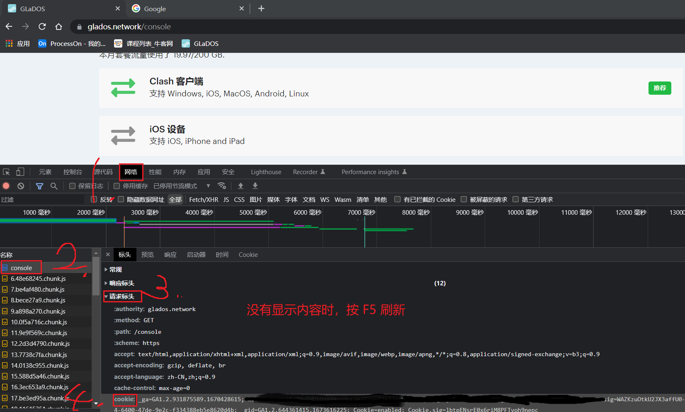
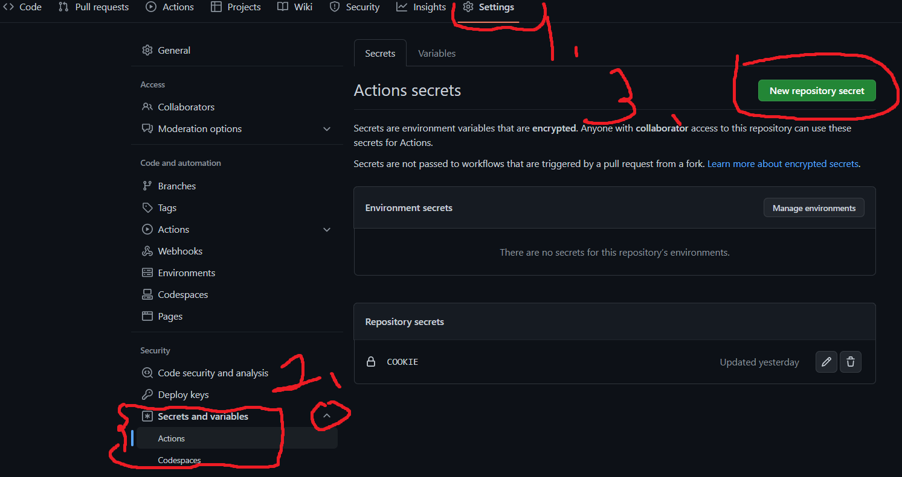
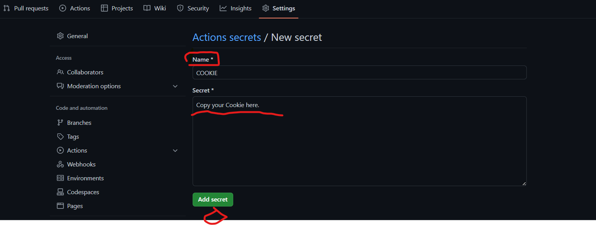
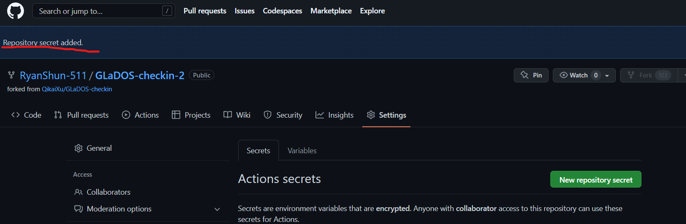
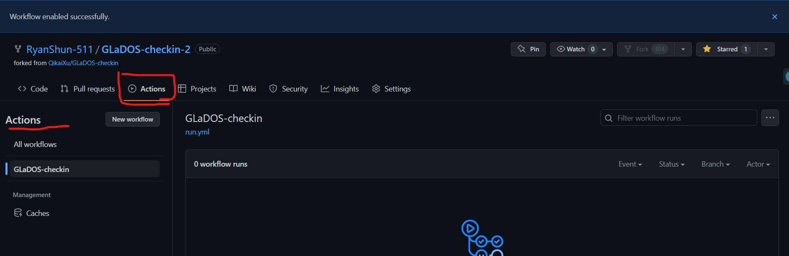
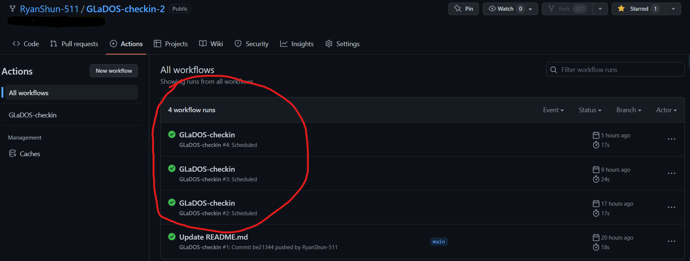
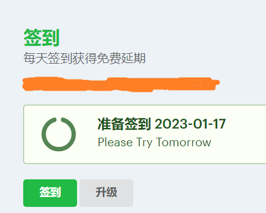

# GLaDOS-checkin

薅薅羊毛，**帅哥美女们顺手点个 star 吧，万分感谢🤭**

通过 github action 来实现 GLaDOS 自动签到，每天签到可以延时一天。

但是当签到达一定次数后，将会返回 `Checkin! Get 0 day(Your lucky chance is 33%), try next time.`。大概意思就是 1/3 的几率获得 1 天的奖励。


如果还没有注册的话，可以去[GLaDOS 官方github](https://github.com/glados-network/GLaDOS)，点击注册(Register)

然后填写邀请码：`MGCRL-ZKP0W-DIL24-JXZIB`， 双方都可以获得奖励天数哦~。通过邀请码，您会获得 3天的免费使用，然后使用以下步骤进行自动签到(checkin)，一直免费使用。

## 步骤

### 1 Fork 这个仓库

点击右上角的 Fork。

### 2 获取 cookie

在 [GLaDOS](https://glados.rocks/console/checkin) 的网页上按 F12，进行请求，查看请求的 cookie，如下图所示：



### 3 设置 cookie

在 fork 后**自己的仓库**中依次点击 `Settings` - `Secrets` - `New repository secret`，如下图所示：

然后添加一个名为 `COOKIE` 的变量，内容为获取到的 cookie。

`COOKIE` 示例：

```text
__cfduid=d526a2a21******c5521611332007; _ga=GA1.2.101***3158.1611332010; _gid=GA1.2.11***23.1611332010; koa:sess=eyJ1c2VyS******fZXhwaXJlIjoxNjM3MjU0NjEzMTEyLCJfbWF4QWd****yMDAwMDAwMH0=; koa:sess.sig=m6KAoBnv1s***DldbtvNw1v8; _gat_gtag_UA_10***600_2=1
```







### 4 运行 

随便发起一个 push 请求，在README.asset 文件中随便修改点什么 或者 自己给自己点个 star，然后“commit changes”，就可以开始看到workflow中有显示新的内容。之后就会 **每隔 6 小时进行一次签到** （因为有时候签到会失败，好像是服务器不太好，就设置一下每小时签到一次保证成功吧）。



一开始 workflow 为空，**6 个小时内就会为我们签到一次，就会有“GLaDOS-checkin”。**



**第二天先查看 github repostory中的Actions，workflow run 成功后到GLaDOS中查看，天数还是昨天的天数。**



注意，在官方文档中有这么一段：

> To prevent unnecessary workflow runs, scheduled workflows may be disabled automatically. When a public repository is forked, scheduled workflows are disabled by default. In a public repository, scheduled workflows are automatically disabled when no repository activity has occurred in 60 days.

也就是说，**定时执行的任务需要每隔 60 天激活一次**。

